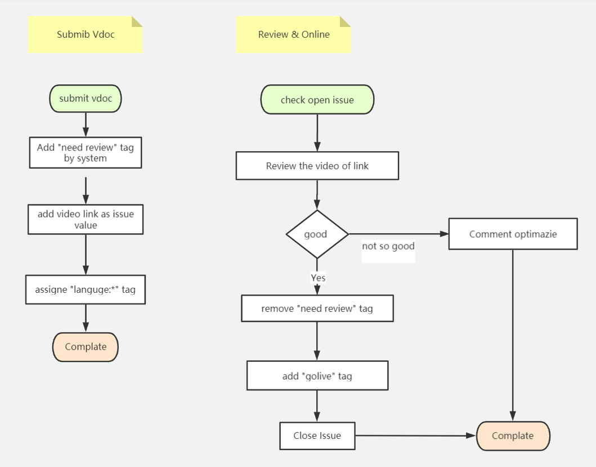

## Welcome to Video Doc system
VDoc system aim at linking the high quality video to the related document,the video will review by more experiencer, so when beginners read the  document they can find more related video  to get more explaination.
Now we are still on test phase, we will use https://github.com/vdoc-online/buzz as issues repo, after basic testing we will move the issues repo here and go live
## How vdoc-system work now
1. Add vdoc support on your site
2. When user click vdoc, it will list all sumibt video documents on new page, user can submit the new video document on the page
3. All submit vdoc will as an issue on [`vdco-system`](http://www.github.com/vdoc-online/vdoc-system/issues) repo, and the domain as `label` url as issue `title`
4. Working flow
   
## How to intergrateion
1. Apply intergration here [vdoc-sre](https://github.com/vdoc-online/vdoc-sre) with your doc domain information as an issue, system manager will add your domain to the database repo, then follow below steps for intergration
   
2. Add Vdoc Element with id `vdoc`
```html
<a id="vdoc" target="_blank">Vdoc</a> <!-- Entry HTML Element -->
```
3. Import Vdoc js
```javascript
<script src="http://www.vdoc.online/assets/vdoc.js"></script>
```
<a id="vdoc" target="_blank">Vdoc</a>
<script src="http://www.vdoc.online/assets/vdoc.js"></script>

Join Slack 

[https://vdoc-online.slack.com](https://join.slack.com/t/vdoc-online/shared_invite/zt-gfhczmvk-nuBKAG9lPaMyTM2VDcoWBQ)
